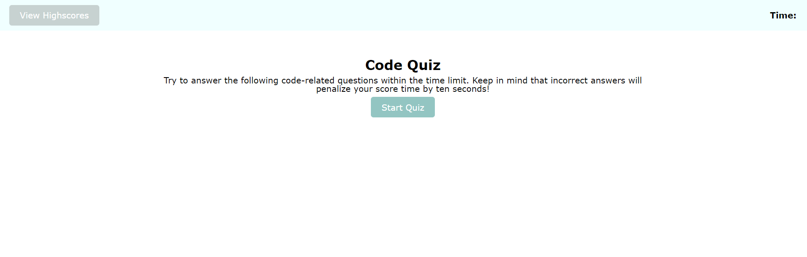
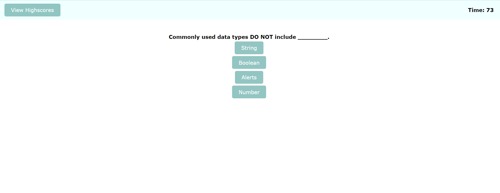
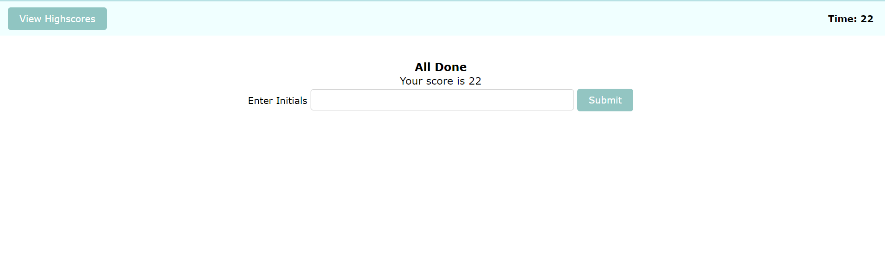

# Code-Quiz
## Description
This project is a timed coding quiz with multiple-choice options. The application runs in browser, and it features dynamically updated HTML and CSS powered by Javascript code.

## Table of Contents

- [Webpage Preview](#webpage-preview)
- [Usage](#usage)
- [Code-Snippet](#code-snippet)
- [License](#license)

## Webpage Preview






## Usage

The link of the webpage is: https://anicabarrios.github.io/Code-Quiz/

- Step 1: Load the webpage.<br/>
- Step 2 :Click the "start" button to start the quiz and the timer.<br/>
- Step 3 :Choose one from the four choices and you will see whether your answer is correct right away.<br/>
- Step 4 :When you complete all the questions, or the time runs out, your score will be displayed and you can write down your initials and submit.<br/>
- Step 5 :After submiting your initial, you can always check Highscore record to see your top scores.<br/>
- Step 6 :Clear the local record by simply hit the "clear Highscores" button.<br/>
Please note that: The total time set for the quiz is 75 seconds. When you answer question wrong, 10 seconds will be subtracted from the timer.

## Code-Snippet

Function to start the timer
```
function startTimer() {
    timerEl.textContent = timeRemaining--;
    // If time runs out, end the quiz
    if (timeRemaining < 0) {
        endQuiz();
    }
}
```
```
// Function to render a question
function renderQuestion() {
    messageEl.innerHTML = "";
    questionTitleEl.textContent = questionData[index].title;
    choiceListEl.textContent = "";

    // Create buttons for each choice of the current question
    for (var i = 0; i < questionData[index].choices.length; i++) {
        var li = document.createElement("li");
        var button = document.createElement("button");
        button.textContent = questionData[index].choices[i];
        li.appendChild(button);
        choiceListEl.appendChild(li);
    }
}
```

Function to submit the score
```
function submitScore() {
    var initials = document.getElementById("initial").value.trim();
    if (initials !== "") {
        var score = parseInt(scoreEl.textContent);
        var highScores = JSON.parse(localStorage.getItem("highScores")) || [];
        highScores.push({ initials: initials, score: score });
        localStorage.setItem("highScores", JSON.stringify(highScores));
        displayHighScores();
        initialInputEl.classList.add("hide");
        highscoreEl.classList.remove("hide");
    } else {
        alert("Please enter your initials.");
    }
}
```
Function to display high scores
```
function displayHighScores() {
    highscoreListEl.innerHTML = "";
    var highScores = JSON.parse(localStorage.getItem("highScores")) || [];
    highScores.sort((a, b) => b.score - a.score); // Sort high scores in descending order
    // Display high scores on the page
    highScores.forEach(function (score) {
        var li = document.createElement("li");
        li.textContent = score.initials + " - " + score.score;
        highscoreListEl.appendChild(li);
    });
}
```

## License

MIT License